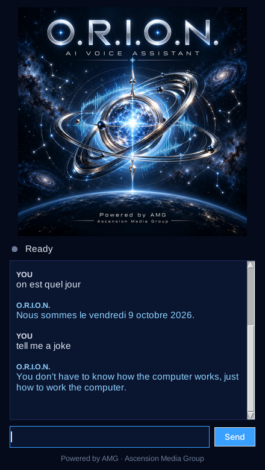

# O.R.I.O.N. — AI Voice Assistant

<p align="center">
  
</p>

<p align="center"><b>A bilingual (English 🇬🇧 / French 🇫🇷) desktop voice assistant for Windows, macOS and Linux.</b><br>
Powered by AMG · Ascension Media Group</p>

O.R.I.O.N. listens on your microphone, works out whether you spoke English or French, and answers in the same language. Run it from one script, `orion.py`. It opens a small window built around the O.R.I.O.N. artwork, and you can also run it in the terminal.

<p align="center"></p>

## Features

| | English example | Exemple en français |
|---|---|---|
| Greets you by time of day | *(at start-up)* | *(au démarrage)* |
| Time & date | "What time is it?" · "What's the date?" | « Quelle heure est-il ? » · « On est quel jour ? » |
| Open any website | "Open YouTube" · "Open github dot com" | « Ouvre Google » · « Ouvre lemonde point fr » |
| Google / YouTube search | "Search for cheap flights" · "Play Daft Punk on YouTube" | « Cherche des recettes de crêpes » · « Cherche Stromae sur YouTube » |
| Wikipedia summary (read aloud) | "Who is Marie Curie?" · "Search Wikipedia for black holes" | « Qui est Victor Hugo ? » · « Parle-moi de la tour Eiffel » |
| Local music | "Play music" · "Play song get lucky" | « Joue de la musique » · « Mets la chanson alors on danse » |
| Jokes | "Tell me a joke" | « Raconte-moi une blague » |
| Screenshots | "Take a screenshot" | « Fais une capture d'écran » |
| Quick notes | "Take a note call the bank tomorrow" · "Read my notes" | « Prends une note acheter du pain » · « Lis mes notes » |
| Shut down / restart *(asks for confirmation first)* | "Shut down the computer" · "Restart" | « Éteins l'ordinateur » · « Redémarre » |
| Language | "Speak French" · "Bilingual mode" | « Parle anglais » · « Mode bilingue » |
| Help / stop | "Help" · "Goodbye" | « Aide » · « Au revoir » |

You can start a command with *"Hey Orion"*, but you don't have to.

### When something goes wrong
- **Missed or unclear speech:** O.R.I.O.N. ignores silence. If it hears something it doesn't understand, it says so and suggests "help". It never crashes on bad input.
- **Missing details:** say "Open…" or "Take a note" on its own and it asks what you meant.
- **No microphone or PyAudio:** it tells you and switches to typed commands.
- **No internet:** speech recognition and Wikipedia need a connection. O.R.I.O.N. tells you once and keeps running.
- **No text-to-speech engine:** replies are still shown on screen.
- **A command fails:** the error is logged, O.R.I.O.N. tells you, and it keeps listening.

## Quick start

**Requires Python 3.9+.**

### 1. System packages (only for the microphone and the voice)

| OS | Command |
|---|---|
| **Windows** | Nothing extra. PyAudio installs from a wheel. |
| **macOS** | `brew install portaudio` |
| **Ubuntu / Debian** | `sudo apt install python3-tk python3-dev portaudio19-dev espeak-ng alsa-utils xdg-utils` |
| **Fedora** | `sudo dnf install python3-tkinter python3-devel portaudio-devel espeak-ng alsa-utils xdg-utils` |

For French speech, install a French voice:
- **Windows:** Settings → Time & Language → Speech → *Add voices* → Français (France).
- **macOS:** System Settings → Accessibility → Spoken Content → System voice → *Manage Voices* → French (e.g. Thomas or Amélie).
- **Linux:** `espeak-ng` already includes French.

### 2. Install and run

```bash
git clone https://github.com/eltesla205art/AMG-Jarvis-Desktop-Voice-Assistant.git
cd AMG-Jarvis-Desktop-Voice-Assistant
python -m venv .venv
# Windows: .venv\Scripts\activate      macOS/Linux: source .venv/bin/activate
pip install -r requirements.txt
python orion.py
```

On macOS, allow microphone access for your terminal the first time (System Settings → Privacy & Security → Microphone).

### Options

```bash
python orion.py              # window + voice (type commands in the box too)
python orion.py --console    # terminal only
python orion.py --text       # type instead of speaking (no microphone needed)
python orion.py --lang fr    # French only  (en = English only, auto = both, default)
python orion.py --debug      # verbose logs
```

## Configuration

Copy `orion_config.example.json` to `orion_config.json` and change only the keys you need:

| Key | Default | Meaning |
|---|---|---|
| `user_name` | `""` | Your name, used in greetings |
| `language` | `"auto"` | `auto` (English + French), `en` or `fr` |
| `default_language` | `"en"` | Language used for the greeting |
| `music_dir` | your Music folder | Folder searched for `.mp3 .flac .wav .ogg .m4a…` files (subfolders included) |
| `notes_file` | `~/ORION/notes.txt` | Where notes are saved |
| `screenshot_dir` | `~/Pictures/ORION` | Where screenshots are saved |
| `confirm_power_actions` | `true` | Ask "are you sure?" before shutting down or restarting |
| `listen_timeout` / `phrase_time_limit` | `6` / `12` | Seconds to wait for speech / maximum command length |
| `speech_rate` | `175` | Speaking speed |
| `text_mode` | `false` | Always use typed commands |

## How it works

```
orion.py                 ← the one script you run
orion/
  assistant.py           ← listen → understand → act loop, language detection
  voice.py               ← Speaker (macOS `say` / pyttsx3) and Listener (SpeechRecognition)
  i18n.py                ← every sentence, in English and French
  text.py                ← accent/punctuation-insensitive phrase matching
  config.py              ← settings + orion_config.json
  platform_utils.py      ← open files/URLs, shut down/restart, per OS
  gui.py / ui.py         ← window and terminal front-ends
  skills/                ← one file per feature (clock, web, wiki, music, jokes, screenshot, notes, system, general)
tests/test_orion.py      ← offline tests: python -m unittest discover tests
```

**Language detection.** Every phrase you say is first transcribed in the current language. If that transcript doesn't clearly match a command, the same audio is also transcribed in the other language. O.R.I.O.N. keeps the transcript that matches a command *in its own language*. French run through the English recognizer rarely turns into a valid English command, so this choice is reliable. Replies follow the language you last used.

**Speech engines.** Recognition uses the free Google Web Speech API through the `SpeechRecognition` package, so it needs internet access. Speech output works offline: SAPI5 on Windows, `say` on macOS and eSpeak NG on Linux.

## Adding your own command

Create a file in `orion/skills/`. It is picked up automatically:

```python
# orion/skills/weather.py
from . import skill

@skill("weather", en=["weather", "forecast"], fr=["météo", "quel temps"])
def weather(ctx, req):
    city = req.rest or "your city"     # words spoken after the trigger
    ctx.say_text(f"Looking up the weather in {city}..." if ctx.lang == "en"
                 else f"Je regarde la météo à {city}...")
```

- `ctx.say(key, **values)` speaks a sentence from `i18n.py` in the current language. `ctx.say_text(text)` speaks any text.
- `ctx.ask(key)` asks a question and returns the answer. `ctx.confirm(key)` returns True or False.
- `ctx.lang`, `ctx.config`, `ctx.stop()`.
- `req.raw`, `req.rest` (text after the trigger) and `req.before` (text before it).

When two trigger phrases match, the longer one wins. Add the trigger in both languages and put new sentences in both blocks of `i18n.py`.

## Troubleshooting

| Problem | Fix |
|---|---|
| `Could not find PyAudio` / no microphone | Install the system packages above, then `pip install PyAudio`. Or use `--text`. |
| It speaks English with an English voice when you speak French | Install a French system voice (see above). |
| Linux: no sound from the voice | Install `espeak-ng` and `alsa-utils`. |
| Linux Wayland: screenshot fails | Install `gnome-screenshot` or `grim`, which Pillow uses as a fallback. |
| Linux: shutdown or restart refused | Your session must be allowed to run `systemctl poweroff` / `reboot` (the default on desktop distros). |
| No window appears | Install Tk (`python3-tk`), or run with `--console`. |

## Credits & license

O.R.I.O.N. is built by AMG · Ascension Media Group on top of the open-source [Jarvis Desktop Voice Assistant](https://github.com/kishanrajput23/Jarvis-Desktop-Voice-Assistant) by Kishan Kumar Rai. The original script is still in `Jarvis/` for reference; it needs `pip install pyautogui wikipedia pyttsx3 SpeechRecognition pyjokes`.

Released under the [MIT License](LICENSE).
